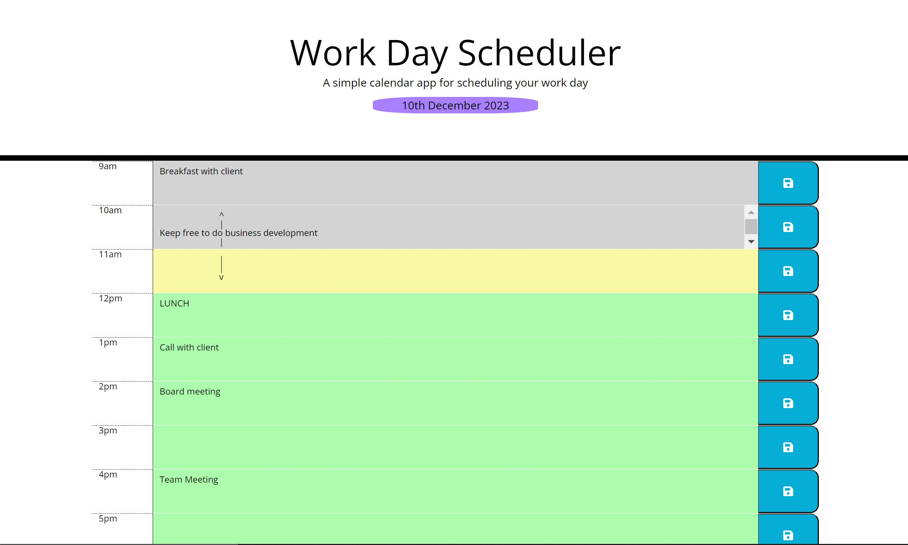
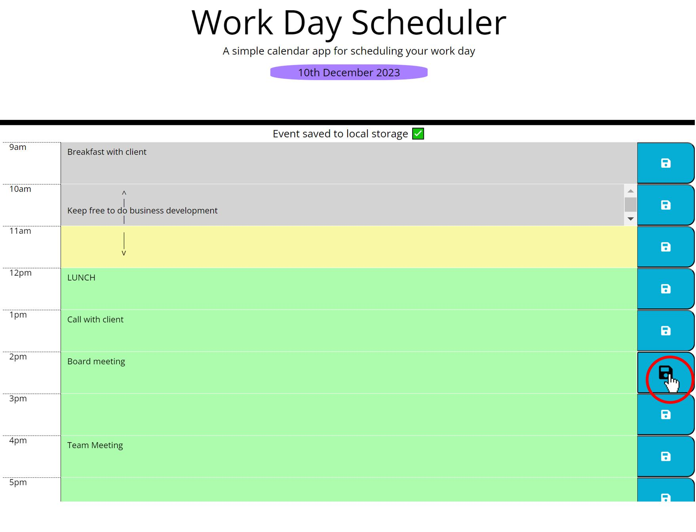
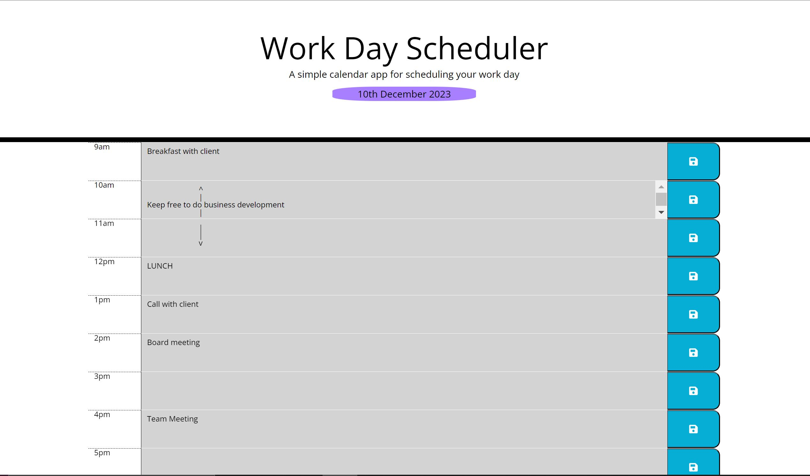
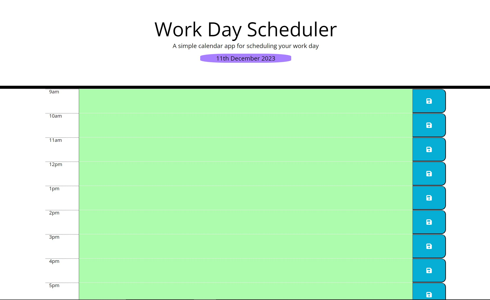

# Work Day Scheduler

## Description

As an employee with a busy schedule, I want to add important events to a daily planner so that I can manage my time effectively.

This work day scheduler has been achieved by:
* Creating a UI that displays today's date and below, shows time slots for the working day (9am - 5pm).
*  As the time changes throughout the day, the time slots change colour to allow the user to easier identify the time:
    * Grey - For previous time
    * Yellow - For current time
    * Green - For future time 

 

* Each time slot allows the user to add their schedule info and save it so that if the page is refreshed or reloaded, their info persists for that current day.
    * When the save button is clicked, a message appears at the top of the planner to notify the user that the changes have been saved: 

* When the current date changes, the scheduler resets ready to start adding that days schedule. 
    * Scheduler at 23:59 on 10th Dec 2023: 

    * Scheduler at 00:00 on 11th Dec 2023:

## Installation

Please use the following link to access the website: https://e-davies.github.io/Work-Day-Scheduler/

## Usage

This application will be used by employees to organise their time. 

## Skills used in this project

Also:
* Day.js
* Local Storage